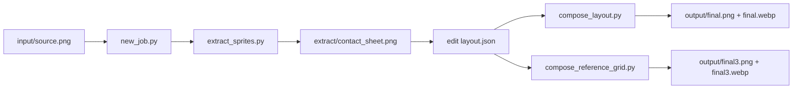

# Image Cutout + Sheet Composer (Prototype)

[English](README.md) | [简体中文](README.zh-CN.md)

A lightweight toolkit for animation-asset production workflows:

- automatic image cutout/extraction from source images
- ID-based layout composition
- PNG/WEBP sheet export with optional edge tuning and grid-ready output

## Documentation

- [Tool overview (CN)](docs/tool-overview.md)
- [Workflow diagram](docs/workflow.md)
- [CLI parameter reference (CN)](docs/cli-reference.md)
- [Public sample walkthrough](samples/demo_work/README.md)

## Pipeline at a Glance



Project policies:

- Contributing: `CONTRIBUTING.md`
- Security: `SECURITY.md`
- Support: `SUPPORT.md`
- Code of Conduct: `CODE_OF_CONDUCT.md`
- Asset rights: `ASSETS_LICENSE.md`
- Changelog: `CHANGELOG.md`

## Core Scripts

- `scripts/new_job.py`: initialize a new job workspace
- `scripts/extract_sprites.py`: connected-component extraction + contact sheet
- `scripts/compose_layout.py`: row-based composition (`strip` / `compact`)
- `scripts/compose_reference_grid.py`: strict frame-grid output + edge tuning

## Repository Layout

```text
image-cutout-composer/
  scripts/
  docs/
  samples/
    demo_work/
  requirements.txt
```

Notes:

- `old/` can be used as a local archive, but it is git-ignored and not published.
- `jobs/` is a local workspace for intermediate runtime artifacts (`input/`, `extract/`, `output/`, `layout.json`) and is fully git-ignored.

## Setup

```bash
python3 -m venv .venv
.venv/bin/pip install -r requirements.txt
```

## Quick Start

1. Create a job:

```bash
JOB_NAME=my_job
.venv/bin/python scripts/new_job.py \
  --job "$JOB_NAME" \
  --source /path/to/source.png \
  --reference /path/to/reference.webp
```

2. Set the job workspace path (default output from `new_job.py`):

```bash
JOB_DIR="jobs/$JOB_NAME"
```

3. Extract:

```bash
.venv/bin/python scripts/extract_sprites.py --job-dir "$JOB_DIR"
```

4. Edit `"$JOB_DIR/layout.json"` by checking `"$JOB_DIR/extract/contact_sheet.png"`.

5. Compose:

```bash
.venv/bin/python scripts/compose_layout.py --job-dir "$JOB_DIR" --style compact
```

6. Optional strict grid + edge tuning:

```bash
.venv/bin/python scripts/compose_reference_grid.py \
  --job-dir "$JOB_DIR" \
  --frame-width 256 \
  --frame-height 256 \
  --defringe-white \
  --outline-size 1 \
  --blacken-fringe
```

## Contributors

- [@Sariel2018](https://github.com/Sariel2018)

## Credits

- OpenAI Codex (ChatGPT): implementation, refactoring, and documentation assistance.
- All AI-assisted changes are reviewed and merged by the repository maintainer.

## License

Code is licensed under MIT (`LICENSE`).

## Asset Rights

Art/image assets are licensed separately. See `ASSETS_LICENSE.md`.
