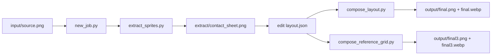

# Workflow Diagram

This file is for GitHub readers who want a quick overview of the pipeline and what is public vs local.

## Pipeline

## Open Source Boundary

- Public in repo:
  - `scripts/`
  - `README.md`
  - `docs/tool-overview.md`
  - `docs/workflow.md`
  - `jobs/demo_work/layout.json` + placeholders
- Keep local (do not commit unless rights are clear):
  - `jobs/**/input/*`
  - `jobs/**/extract/crops/*`
  - `jobs/**/output/*`
  - historical snapshots in `old/`
  - any character art / reference sheets you designed
